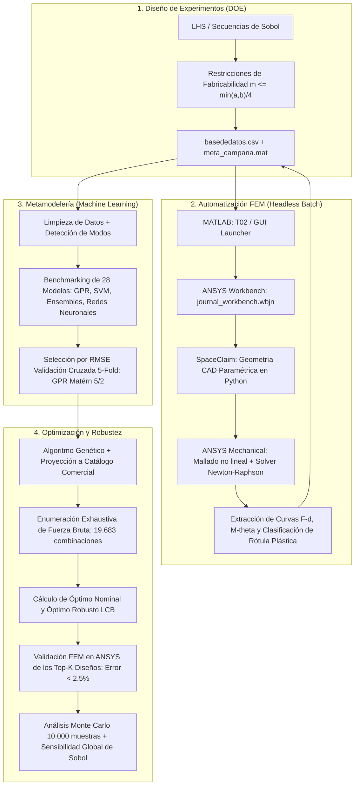

# Optimización Estructural de Arcos de Seguridad Antivuelco (ECE R66) mediante Metamodelos y Simulación FEM Automatizada

[](https://www.mathworks.com/products/matlab.html)
[](https://www.ansys.com/)
[](https://www.python.org/)
[](https://en.wikipedia.org/wiki/Kriging)
[](https://unece.org/transport/vehicle-regulations)
[](LICENSE)

> **Trabajo Fin de Grado (TFG) — Escuela Técnica Superior de Ingenieros Industriales (ETSII), Universidad Politécnica de Madrid (UPM)**  
> **Autor:** Pablo Turrado Vega  
> **Área:** Ingeniería Mecánica, Seguridad Pasiva en Vehículos, Simulación Numérica (CAE/FEM), Metamodelería (IA/Machine Learning) y Optimización Evolutiva.

---

## Resumen Ejecutivo

Los accidentes por vuelco en autobuses y autocares constituyen uno de los escenarios de mayor severidad en el transporte colectivo de pasajeros. El **Reglamento ECE R66** exige que la superestructura absorba la energía potencial liberada en el vuelco sin invadir el espacio residual de supervivencia de los ocupantes.

El dimensionamiento óptimo de las secciones estructurales exige evaluar la respuesta elastoplástica en grandes deformaciones mediante **análisis no lineal por elementos finitos (FEM)**. Sin embargo, el elevado coste computacional de estas simulaciones (de 20 a 60 minutos por diseño) imposibilita una exploración exhaustiva directa mediante optimización clásica.

Este proyecto desarrolla e implementa un **marco computacional integral y autónomo** que resuelve este cuello de botella:
1. **Automatización integral FEM:** Control desatendido en lote (*headless*) de **ANSYS Workbench, SpaceClaim y Mechanical** mediante scripts en Python y MATLAB, acumulando **1.340 simulaciones y más de 400 horas de cómputo**.
2. **Diseño de Experimentos (DOE):** Exploración sistemática del espacio geométrico de 6 y 7 variables mediante **secuencias cuasi-aleatorias de Sobol** de baja discrepancia y muestreo hipercúbico latino (**LHS**).
3. **Metamodelería con Machine Learning:** Entrenamiento y comparación automatizada de **28 familias de modelos de regresión**. El modelo óptimo (**Regresión por Procesos Gaussianos / GPR con núcleo Matérn 5/2**) predice la energía absorbida en milisegundos con un **$R^2 = 0{,}987$ y RMSE-CV de 132,6 J**.
4. **Optimización con Algoritmos Genéticos (GA):** Búsqueda evolutiva sobre el metamodelo combinada con discretización a catálogo comercial de perfiles huecos de acero estructural (**EN 10210-2**).
5. **Validación Numérica Real:** La sección óptima obtenida se re-simula en ANSYS, confirmando una absorción de energía específica (**SEA**) de **469,0 J/kg**, lo que representa una **mejora del +135 % frente a la media del espacio de diseño** y un **error del metamodelo de solo el 2,42 % (sin sesgo optimista)**.
6. **Robustez y Análisis Probabilista:** Verificación de tolerancias de fabricación mediante **10.000 muestras Monte Carlo** (clasificación de robustez ALTA, CV = 0,85 %) y **cumplimiento del 100 % del umbral de la ECE R66**.
7. **Aplicación Gráfica (GUI):** Interfaz completa desarrollada en MATLAB orientada a objetos (`classdef`, ~4.400 líneas) para operar, visualizar y transferir el flujo a entornos industriales sin modificar código.

---

## Resultados Destacados

| Métrica / Indicador | Valor / Resultado | Impacto / Relevancia |
|---|---|---|
| **Simulaciones Totales** | **1.340 simulaciones FEM** | 5 campañas completadas (LHS-60, Sobol-512, Cateto Variable-512, S275JR-128, S355JR-128). |
| **Tiempo de Cómputo Automatizado** | **> 400 horas** | Ejecución batch desatendida en ANSYS Mechanical con reanudación automática. |
| **Mejor Modelo Predictivo** | **GPR Matérn 5/2** | $R^2 = 0{,}987$, RMSE-CV = 132,6 J (error relativo del 2,4 % sobre el rango). |
| **Aceleración Computacional** | **> 100.000×** | Predicción analítica en < 1 ms frente a ~30 min de la simulación FEM no lineal. |
| **SEA Óptima Validada en ANSYS** | **469,0 J/kg** | Frente a 199,3 J/kg (media del espacio) $\rightarrow$ **+135 % de mejora de absorción específica**. |
| **Error en el Óptimo** | **2,42 %** | Predicción: 457,7 J/kg vs FEM real: 469,0 J/kg (predicción conservadora). |
| **Espacio de Búsqueda Discreto** | **19.683 a 216.513 diseños** | Verificación por enumeración exhaustiva de que el GA alcanzó el óptimo global. |
| **Robustez Monte Carlo (10.000 it)** | **CV = 0,85 %** | Coeficiente de variación despreciable frente a tolerancias según EN 10210-2. |
| **Conformidad Normativa ECE R66** | **100,0 % de cumplimiento** | $P(\text{SEA} \ge E_{\text{umbral}} = 285{,}2\text{ J/kg}) = 100\,\%$. |

---

## Arquitectura del Pipeline

El flujo de trabajo acopla de manera modular los entornos de cálculo numérico, modelado geométrico y elementos finitos:



---

## Interfaz Gráfica de Usuario (`TFG_GUI.m`)

Para facilitar la adopción, experimentación y análisis sin necesidad de modificar código fuente, se ha desarrollado una aplicación completa en MATLAB:

* **Arquitectura:** Programación orientada a objetos (`classdef TFG_GUI < handle`), con más de **4.400 líneas de código y más de 80 métodos**.
* **Gestión de Campañas:** Selector dinámico de campañas que conmuta datos, modelos y logs de forma aislada.
* **Módulos Integrados:**
  1. **Pestaña DOE:** Configuración visual de límites por variable, fijación de parámetros, simetrías y matrices de correlación en tiempo real.
  2. **Pestaña Simulaciones:** Ajuste de propiedades de material ($f_y$, $E_t$), parámetros de discretización temporal (subpasos) y mallado adaptativo con *Sphere of Influence*. Monitorización en vivo del batch de ANSYS.
  3. **Pestaña Entrenamiento:** Entrenamiento desatendido de hasta 28 modelos de regresión, análisis de residuos y clasificación de modos de fallo.
  4. **Pestaña Optimización GA:** Algoritmo genético continuo y discreto concurrentes, exploración de catálogo por fuerza bruta y calculadora de umbral ECE R66.
  5. **Pestaña Validación:** Automatización de re-simulación en ANSYS de los diseños ganadores (*winner's curse check*).
  6. **Pestaña Monte Carlo:** Simulación de tolerancias dimensionales con histogramas de dispersión y cálculo de sensibilidad global de Sobol.
  7. **Visor de Simulaciones:** Explorador de resultados individuales con gráficos de momento-rotación y visualizador de tensiones de von Mises exportadas por ANSYS.

---

## Metodología Detallada

### 1. Geometría y Variables de Diseño
La estructura modela la unión crítica pilar-larguero (sección en L) de un arco de seguridad antivuelco de autobús, construida mediante perfiles tubulares rectangulares unidos a inglete y reforzados por una cartela triangular:
* **$m_1$**: Espesor de pared del pilar (Viga A) $[2, 4]$ mm.
* **$a_1$**: Altura de la sección del pilar $[40, 100]$ mm.
* **$m_2$**: Espesor de pared del larguero (Viga B) $[2, 4]$ mm.
* **$a_2$**: Altura de la sección del larguero $[40, 100]$ mm.
* **$b$**: Anchura común de ambas vigas ($b = b_1 = b_2$) $[40, 100]$ mm.
* **$e_\text{cartela}$**: Espesor de la chapa de la cartela triangular $[2, 4]$ mm.
* **$c$**: Longitud de los catetos de la cartela (80 mm fijo en campaña principal; extendido a $[70, 120]$ mm en campaña de cateto variable).

**Restricción de manufacturabilidad (laminación en caliente EN 10210-2):**
$$m \leq \frac{\min(a, b)}{4}$$

### 2. Indicador de Rendimiento (KPI)
El objetivo es maximizar la **Energía Específica Absorbida (SEA)** a lo largo de un desplazamiento lateral cuasi-estático impuesto de 500 mm:
$$\text{SEA} = \frac{E_J}{m} \quad [\text{J/kg}]$$
donde $E_J$ es la integral de la curva fuerza-desplazamiento y $m$ es la masa analítica exacta de la estructura calculada mediante `masa_analitica.m` (concordancia con ANSYS > 99,99 %).

### 3. Modos de Fallo y Cinemática del Colapso (`calcular_pivot.m`)
A partir de la coordenada $Y$ del punto de plastificación máxima ($y_\text{max}$), el sistema clasifica de forma determinista el mecanismo de colapso en:
* **Modo Viga:** Rótula plástica puntual formada en el tramo libre del pilar por encima de la cartela ($y_\text{max} > a_2 + c$).
* **Modo Cartela:** Plastificación distribuida en la unión con rotación en bloque de la estructura ($y_\text{max} \leq a_2 + c$).
* **Paradoja de la especialización:** El entrenamiento de modelos especializados por modo (IA$_v$ e IA$_c$) demostró que, aunque mejoran el error predictivo dentro de su modo, **inducen a los optimizadores a esquinas no representativas con sobre-estimaciones de hasta el 28 %**. El metamodelo global (**IA$_0$**) resultó ser superior y más conservador para la optimización.

---

## Principales Hallazgos Científicos y Técnicos

1. **Sensibilidad Global de Sobol (Saltelli / Jansen):**
   * El espesor ($m_1$, $S_T = 0{,}516$) y la altura ($a_1$, $S_T = 0{,}390$) del pilar vertical explican **más del 76 % de la varianza total** de la absorción energética.
   * El espesor de la cartela tiene un impacto prácticamente nulo ($S_T = 0{,}008$), lo que permite relajar sus tolerancias de fabricación sin pérdida de rendimiento.
   * Sin embargo, el **tamaño del cateto ($c$)** sí es determinante: aumentar el cateto a 120 mm incrementa la energía absorbida hasta los **541,2 J/kg (+15 % adicional)**.

2. **Convergencia del Muestreo:**
   * La secuencia de Sobol superó al muestreo LHS al reducir la discrepancia estrellada ($L_2^* = 0{,}0101$ frente a $0{,}0117$) y eliminar correlaciones espurias ($|\rho| \le 0{,}011$ con 512 puntos frente a $0{,}159$ en LHS).
   * La propiedad de extensibilidad de Sobol permitió estudiar la curva de convergencia del error (64 $\rightarrow$ 128 $\rightarrow$ 256 $\rightarrow$ 512 muestras) reduciendo el RMSE un **56 %** sin necesidad de realizar simulaciones adicionales.

3. **Efecto del Grado de Acero (S235JR vs S275JR vs S355JR):**
   * En un estudio pareado de 128 geometrías comunes, el aumento de energía específica escala como un multiplicador casi constante e independiente de la geometría: **1,105× para S275JR** y **1,319× para S355JR**.
   * La ganancia de SEA es subproporcional al incremento de límite elástico ($+10{,}5\,\%$ y $+31{,}9\,\%$ de SEA frente a $+16{,}8\,\%$ y $+50{,}7\,\%$ en $f_y$).
   * **La geometría óptima es idéntica en los tres materiales:** la plantilla dimensional óptima hallada para S235JR maximiza también el rendimiento en aceros de alta resistencia.

---

## Estructura del Repositorio

```text
├── TFG_GUI.m                     # Aplicación Gráfica Integrada en MATLAB OOP (~4.400 líneas)
├── T01_Generar_DOE_Sobol.m       # Generador de plan de experimentos (Sobol / LHS)
├── T02_Lanzar_Simulaciones_Batch.m # Bucle batch desatendido con ANSYS Workbench
├── T03_Entrenar_Modelo_IA.m      # Pipeline CLI para ajuste y exportación del metamodelo
├── T04_Optimizacion_GA.m         # Algoritmo Genético + Fuerza bruta de catálogo
├── T05_Validar_Optimo.m          # Validación FEM de los Top-K diseños en ANSYS
├── T06_Analisis_Montecarlo.m     # Análisis probabilista de robustez (10.000 iteraciones)
│
├── masa_analitica.m              # Cálculo analítico de masa de la sección en L y cartela
├── calcular_pivot.m              # Identificación de rótula plástica, brazo y modo de fallo
├── extraer_gpr.m                 # Extractor universal de objetos RegressionGP
├── analizar_sensibilidad_sobol.m # Estimadores de Saltelli/Jansen para índices de Sobol
│
├── journal_workbench.wbjn        # Plantilla de diario de automatización ANSYS Workbench
├── plantilla_spaceclaim.py       # Macro generadora de geometría 3D en SpaceClaim
├── macro_mechanical.py          # Script de mallado no lineal, condiciones y resolución FEM
│
├── active_campaign.txt           # Puntero a la campaña activa en ejecución
├── Resultados/                   # Datos brutos, CSVs, modelos .mat y carpetas Sim_NNN
│   ├── Sobol_512_L1000_C80_S235JR/   # Campaña principal de 512 muestras
│   ├── Sobol_512_Cvar_L1000_S235JR/  # Campaña de cateto variable (7 variables)
│   ├── Comp_Material_128_S275JR/     # Campaña pareada acero S275JR
│   └── Comp_Material_128_S355JR/     # Campaña pareada acero S355JR
│
└── LaTeX_TFG/                    # Código fuente completo de la memoria del proyecto
    ├── main.tex                  # Documento principal
    ├── capitulos/                # Capítulos individuales (Introducción a Conclusiones)
    └── figuras/                  # Gráficos de alta resolución y capturas de pantalla
```

---

## Guía de Inicio Rápido

### Requisitos de Software
* **MATLAB R2022b o superior** (requiere *Statistics and Machine Learning Toolbox* y *Global Optimization Toolbox*).
* **ANSYS Workbench / Mechanical v2021 R1 a v2025 R2** (únicamente necesario para ejecutar nuevas simulaciones FEM o validaciones; el análisis con modelos ya entrenados y la GUI funcionan de forma independiente sin ANSYS).

### Ejecución de la Interfaz Gráfica
Para abrir la suite de análisis completa:
```matlab
% Desde la raíz del repositorio en la consola de MATLAB:
TFG_GUI
```

### Ejecución por Línea de Comandos (CLI)
Para reproducir secuencialmente el flujo de trabajo:
```matlab
T01_Generar_DOE_Sobol          % 1. Genera el espacio de muestreo en basededatos.csv
T02_Lanzar_Simulaciones_Batch  % 2. Ejecuta la simulación no lineal en ANSYS en lote
T03_Entrenar_Modelo_IA         % 3. Ajusta y selecciona el metamodelo óptimo
T04_Optimizacion_GA            % 4. Optimización con GA y enumeración del catálogo
T05_Validar_Optimo             % 5. Valida el diseño óptimo en ANSYS Mechanical
T06_Analisis_Montecarlo        % 6. Evalúa tolerancias y calcula cumplimiento ECE R66
```

---

## Cita y Referencia Académica

Si utilizas este código, metodologías o resultados en tus investigaciones o proyectos, por favor cita este trabajo:

```bibtex
@mastersthesis{TurradoVega2026TFG,
  author       = {Pablo Turrado Vega},
  title        = {Optimización de secciones estructurales para arcos de seguridad antivuelco de autobús (ECE R66) mediante modelos sustitutos y algoritmos genéticos},
  school       = {Escuela Técnica Superior de Ingenieros Industriales, Universidad Politécnica de Madrid (UPM)},
  year         = {2026},
  type         = {Trabajo Fin de Grado},
  address      = {Madrid, España}
}
```

---

## Licencia
Este proyecto se distribuye bajo la licencia **MIT**. Consulta el archivo `LICENSE` para más información.
